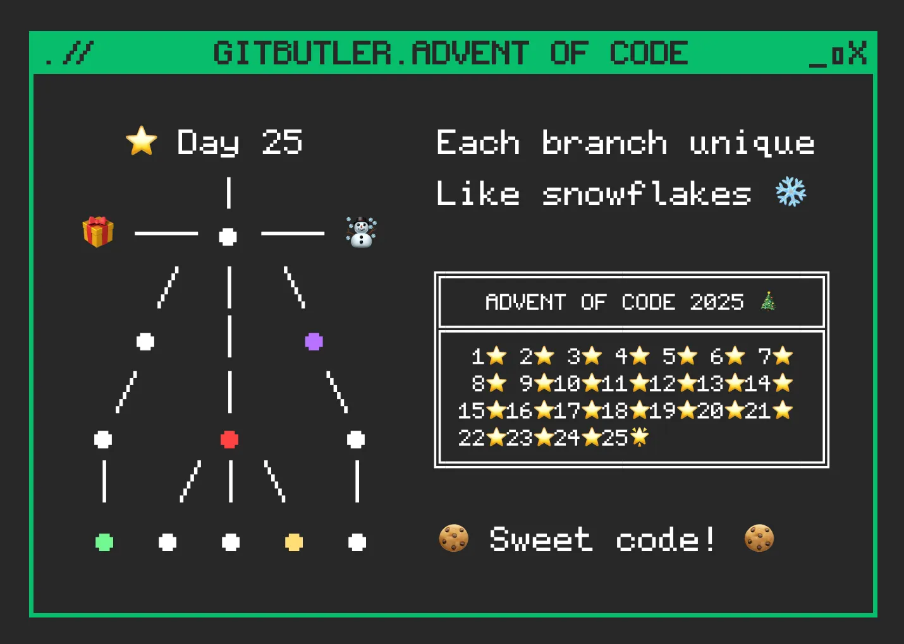
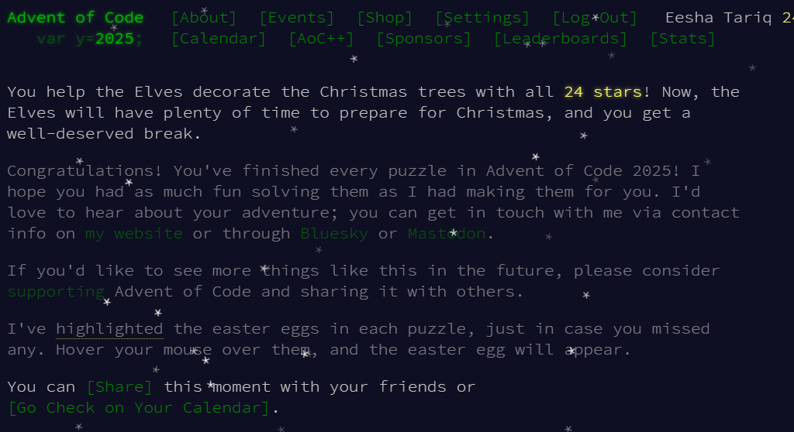
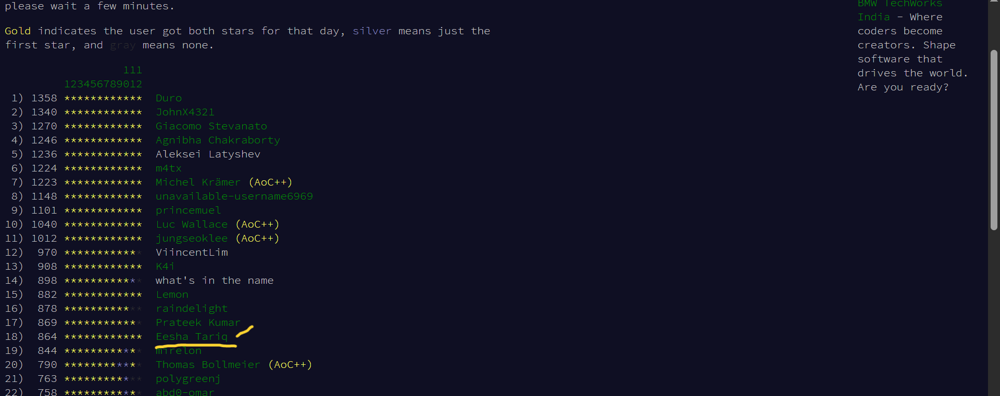
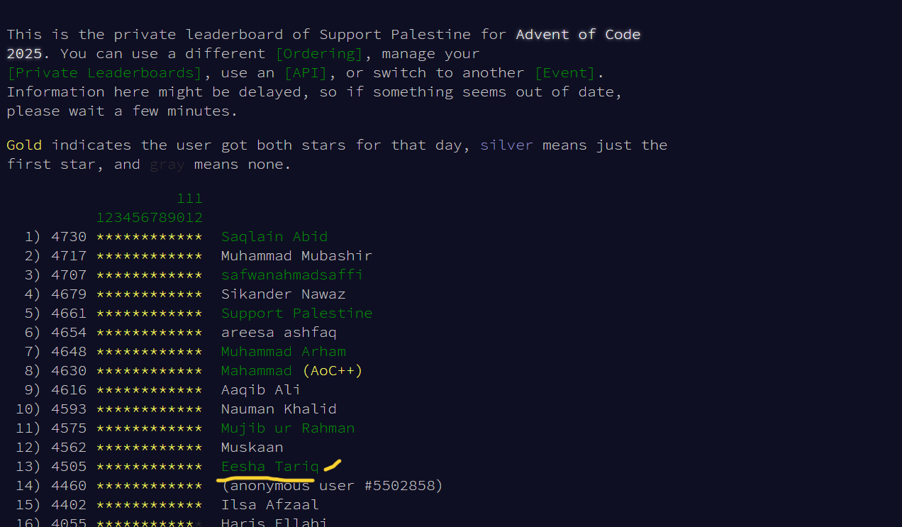
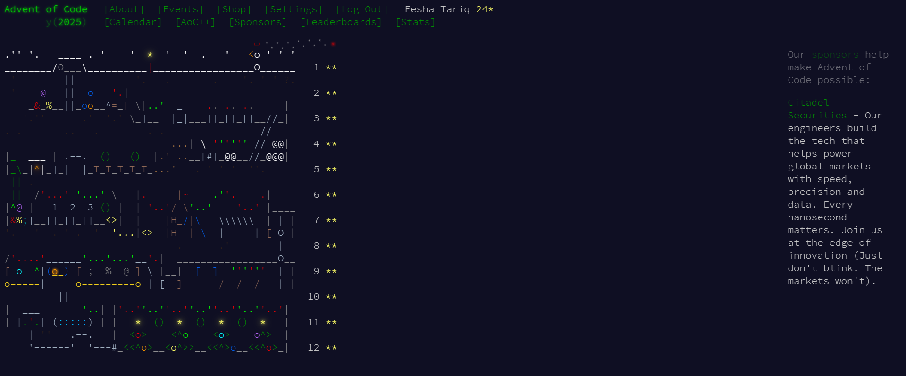

# 🎄 Advent of Code 2025 – Eesha Tariq




Welcome to my **Advent of Code 2025** repository! 🎉  
This repo documents my **daily solutions** for all 25 days of December. I successfully completed the event with **all 24 stars ⭐⭐⭐⭐⭐⭐⭐⭐⭐⭐⭐⭐⭐⭐⭐⭐⭐⭐⭐⭐⭐⭐⭐⭐** — solving each problem in **Python** and **C++**.

---
## Organized by
Advent of Code is an annual programming competition created and organized by Eric Wastl, an independent developer and computer scientist based in the **United States**.


## 📚 Table of Contents

- [About Advent of Code](#about-advent-of-code)  
- [Events & Sponsors](#events--sponsors)  
- [My Achievements](#my-achievements)  
- [Why Participate?](#why-participate)  
- [How to Run Solutions](#how-to-run-solutions)  
- [Repository Structure](#repository-structure)  
- [Insights & Learning](#insights--learning)  
- [About the Author](#about-the-author)  
- [Connect with Me](#connect-with-me)  
- [Credits & Legal](#credits--legal)  

---

## 🎁 About Advent of Code

**Advent of Code (AoC)** is an annual set of holiday-themed programming puzzles created by **Eric Wastl**.

- Puzzles start easy and gradually increase in difficulty.  
- Open to all skill levels and any programming language.  
- Popular for:  
  - Interview preparation  
  - Algorithm practice  
  - Competitive programming  
  - University exercises  

> “You don’t need a CS background—just curiosity and problem-solving.” — *Eric Wastl*

---#AOC Completion


##  Events & Sponsors

- Sponsored by companies like **Jump Trading**.  
- Includes:  
  - Global leaderboards  
  - Country leaderboards  
  - Private leaderboards  
- Runs on any standard hardware — no high-end machines required.

---

## 🌟 My Achievements
### 🏆 AOC Completed | Won 24 Stars 
I solved every puzzle from December 1–25 and earned all **24 stars**.


### 🌍 International Leaderboard — Top 18  


### 🇵🇰 Country Leaderboard — Top 13 in Pakistan  


### 🎄 My Daily Progress Tree  


---

## 🤔 Why Participate?

- Practice algorithms & data structures  
- Improve logical reasoning  
- Strengthen GitHub portfolio  
- Explore recursion, DP, graphs, optimizations  
- Join a global coding community  

---

## 💻 How to Run Solutions

### 1. Clone the Repository
```bash
git clone https://github.com/EeshaTariq/Advent-Of-Code-2025.git
cd Advent-Of-Code-2025
